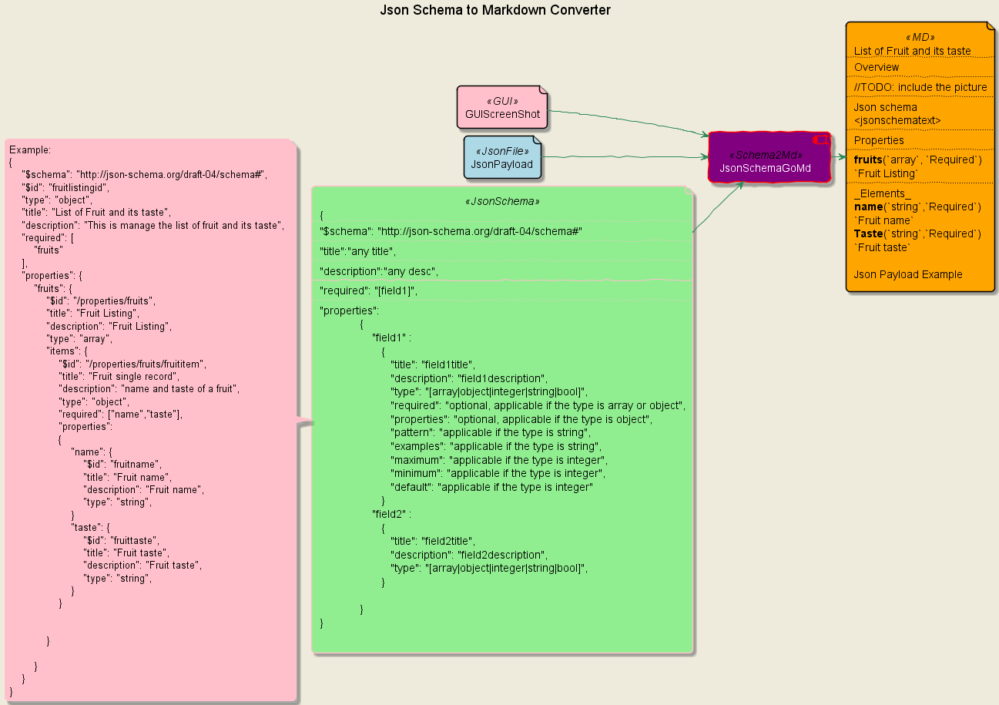
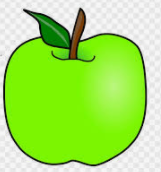

# Create Mark down from Json Schema

## Motivation

While there are a quite number of tools available, however, the level of its achievement does not fit what is expected by our current project.
The information inside the json schema is just too technical and it will not make sense for some groups of the users.
So what it is important about the document is that it should present complex things in simple way.
For this reason, printing every line of json schema into markdown file, for sure is not a good idea as it is full of vocabularies and verbs that are not easy too understand.
This tool will create a markdown file from json schema at minimum deliverable level, and it is ready for further customization, like adding more info about the context of the json payload and etc.

## Convert Json Schema into Markdown File



`Use Case`

A lot of services especially, once to overcome the xml era, are built on top of json. And for that, Json schema is used to define the payload. There is a need to make documentation somewhere as sometimes the audience for the specification of the services is not a developer. For the client who will consume the services, the payload example will give a quick understanding on what data should be prepared. The tool will also attach the images if provided into the document. In markdown style, the layout of the document is something like,

```text
# <schemadescription>
## GUI
## Json Schema and description
## Payload Example

```

`Usability`

A quick way to understand how to use the tool is by launching it directly with `--help` flag

```bash
jschemagomd.exe --help
```

Output is

```text
Create markdown files from all json schema provided inside a specified folder.The supporting document, like .png files and json payload example will be processed by the tool as well, once it follow the naming convention

Usage:
  jschemagomd [flags]

Examples:
jschemagomd -d dir -m mdir

Flags:
  -h, --help                help for jschemagomd
  -d, --jsonFolder string   Specify a directory that contains the json schema and the supporting files
  -m, --mdFolder string     Specify a directory where the Markdown file output to be stored
```

**Supporting Files**

The supporting files are optional. If it is provided, it should follow the naming convention configured in the `jschemagomd.yaml` file

```yaml
jschemagomd:
  schema-file-pattern: "^\\w+\\.schema\\.json$"
  payload-file-pattern: "^%s_payload\\.json$"
  image-file-pattern: "^%s\\w+\\.png$"
```

Basically, the naming convention should follow the rule given as regular expression above.

_Json Schema File_

The name should contain `.schema` and has the `json` extension.

_Json Payload Example_

The name should be suffixed by `_payload` and prefixed with the json schema file name with `.json` extension.

_Image File_

The name should be prefixed with the json schema file name, can contain one or more word character with `.png` extension

To give a better insight, assume that the json schema name is

_`fruittaste.schema.json`_

```json
{
  "$schema": "http://json-schema.org/draft-04/schema#",
  "$id": "fruitlistingid",
  "type": "object",
  "title": "List of Fruit and its taste",
  "description": "This is manage the list of fruit and its taste",
  "required": ["fruits"],
  "properties": {
    "fruits": {
      "$id": "/properties/fruits",
      "title": "Fruit Listing",
      "description": "Fruit Listing",
      "type": "array",
      "items": {
        "$id": "/properties/fruits/fruititem",
        "title": "Fruit single record",
        "description": "name and taste of a fruit",
        "type": "object",
        "required": ["name", "taste"],
        "properties": {
          "name": {
            "$id": "fruitname",
            "title": "Fruit name",
            "description": "The name of fruit",
            "type": "string"
          },
          "taste": {
            "$id": "fruittaste",
            "title": "Fruit taste",
            "description": "How this fruit tastes",
            "type": "string"
          }
        }
      }
    }
  }
}
```

Then subsequently the following is the supporting file names,

_fruittaste.schema_payload.json_

Example

```json
{
  "fruits": [
    { "name": "jack fruit", "taste": "sweet" },
    { "name": "green apple", "taste": "sour" }
  ]
}
```

_fruittaste.schema_jackfruit.png_


_fruittaste.schema_greenapple.png_



Assume that all files are stored in `c:\tmp\sample`.
The folder will have the following files,

```text
c:\sample
    fruittaste.schema.json
    fruittaste.schema_greenapple.png
    fruittaste.schema_jackfruit.png
    fruittaste.schema_payload.json
```

Lets run the tool to create the markdown file with the `c:\tmp\sample` as the foolowing

```text
jschemagomd.exe -m c:\tmp\sample -d c:\tmp\output
```

This is the output folder content

```text
fruittaste.md
fruittaste.schema_greenapple.png
fruittaste.schema_jackfruit.png
```

# Development

`To clone the source code`

```bash
go get github.com/samutayuga/jschemagomd
```

`Build`

```bash
cd github.com/samutayuga/jschemagomd
go build -o jschemagomd.exe .
```
